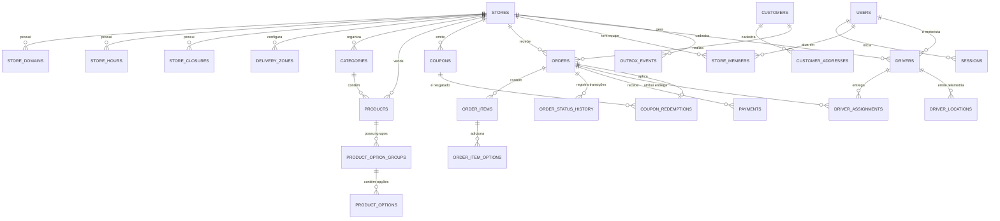

# Diagrama Entidade-Relacionamento (ERD) — Quero Meu Delivery V2

## Descrição das Tabelas Principais

1. **`stores`**: Entidade raiz de cada restaurante (nome, slug, logo, capa, whatsapp, cor primária `#FF6B00`, taxa entrega, pedido mínimo, tempo estimado, chave PIX, status de operação).
2. **`store_domains`**: Domínios personalizados e subdomínios vinculados à loja.
3. **`users`**: Usuários autenticados (`super_admin`, `owner`, `manager`, `kitchen`, `cashier`, `driver`, `customer`).
4. **`sessions`**: Sessões ativas com `token_hash`, expiração, `user_agent`, `ip_address`.
5. **`store_members`**: Vínculo RBAC entre usuário e loja (`owner`, `manager`, `kitchen`, `cashier`).
6. **`categories`**: Categorias do cardápio ordenáveis por loja.
7. **`products`**: Produtos (título, descrição, imagem, preço em centavos, preço promocional, destaque, disponível).
8. **`product_option_groups`**: Grupos de adicionais (ex: "Adicionais Extras", "Remoções Gratuitas", `min_select`, `max_select`, `is_required`).
9. **`product_options`**: Opções individuais (`name`, `price_cents`, `is_available`).
10. **`store_hours`**: Horários por dia da semana (`day_of_week`, `open_time`, `close_time`, `is_closed`).
11. **`store_closures`**: Feriados e datas de fechamento temporário.
12. **`delivery_zones`**: Bairros e zonas com taxa calculada e tempo estimado.
13. **`orders`**: Pedidos criados atomicamente com `tracking_token` (UUIDv4), `order_number`, `subtotal_cents`, `delivery_fee_cents`, `discount_cents`, `total_cents`, `status`, `delivery_type` (`delivery` ou `pickup`), `payment_method`, etc.
14. **`order_items`**: Itens imutáveis do pedido com snapshots dos dados no momento da compra.
15. **`order_item_options`**: Snapshots das opções escolhidas no item com seus valores em centavos.
16. **`order_status_history`**: Log auditável de cada mudança de status, usuário que alterou e observações.
17. **`payments`**: Registro de pagamentos e transações (`pending`, `paid`, `failed`, `refunded`).
18. **`coupons` & `coupon_redemptions`**: Cupons de desconto percentual ou fixo com controle de validade, pedido mínimo e limite atômico de usos.
19. **`drivers` & `driver_assignments`**: Cadastro de motoboys e entregas atribuídas.
20. **`driver_locations`**: Telemetria de localização em tempo real durante entregas ativas.
21. **`outbox_events`**: Eventos persistidos para integração confiável com n8n e Evolution API (WhatsApp).
22. **`idempotency_keys`**: Registro de chaves de idempotência para evitar duplicidade de pedidos e webhooks.
23. **`audit_logs`**: Trilha de auditoria para operações administrativas.
